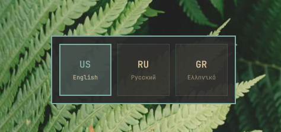

# macOS Keyboard Toggle for Omarchy

> Keyboard layout switching the way macOS and GNOME do it — plus a language manager panel — for [Omarchy](https://omarchy.org/) (Hyprland).



## What it does

On most Linux desktops the layout hotkey walks through every language in a fixed circle: US → Russian → Greek → US. If you mostly type in two languages, you end up tapping twice to get back.

This plugin makes switching behave like macOS and GNOME:

- **Quick tap `Ctrl + Space`** — jump between the **two languages you used last**, no matter how long ago that was.
- **Rapid taps (within 1 second)** — walk through **all** languages. With 3+ languages configured, a HUD card shows which one is selected.
- **Left-click the bar label** — same switch, no hotkey needed.
- **Scroll on the bar label** — walk through all languages, one notch at a time.
- **Right-click the bar label** — open the **language manager**.

## Language manager

Right-click the language label in the bar to:

- see all configured languages and switch between them;
- **add** languages and variants from the installed XKB catalog (searchable list);
- **remove** languages (with confirmation — a Latin layout must stay first so `SUPER` + letter shortcuts keep working);
- turn **macOS-style switching** on or off;
- pick the **XKB switching shortcut** used when macOS-style switching is off.

Changes are validated with `xkbcli`, applied live through Hyprland IPC, and rolled back automatically if the compositor rejects them — no session reload.

## Switching modes

Toggle **macOS-style switching** in the panel:

| Mode | Hotkey behavior |
|------|-----------------|
| **macOS-style** (default) | `Ctrl + Space` toggles the last two languages; rapid taps cycle all. The XKB `grp:` shortcut stays out of the keymap, so nothing double-switches. |
| **XKB** | The chosen XKB shortcut (default `Ctrl + Space`) cycles through all languages sequentially, like a stock setup. Left-click cycles too. |

## Installation

```bash
omarchy plugin add https://github.com/smyrnode/macos-keyboard-toggle --enable
```

Or install via **Omarchy Menu → Plugins**. Once enabled, the bar widget mounts, the switcher script is linked to `~/.local/bin/omarchy-lang-toggle`, and the `Ctrl + Space` hotkey is registered.

For development, clone into `~/.config/omarchy/plugins/smyrnode.macos-keyboard-toggle` and run `./install.sh`.

## Hotkey

The installer registers this binding in `~/.config/hypr/bindings.lua`:

```lua
-- macOS-style language toggle: quick tap toggles last 2, rapid taps cycle all
o.bind("CTRL + SPACE", "Toggle language (macOS-style)", "~/.local/bin/omarchy-lang-toggle")
```

> **Note:** While the panel manages languages it applies `kb_layout`/`kb_options` via a generated toggle that overrides `~/.config/hypr/input.lua`. Keep XKB group-toggle options (such as `grp:ctrl_space_toggle`) out of `input.lua` — the panel owns them.

## How it works

```
smyrnode.macos-keyboard-toggle/
├── manifest.json              # Omarchy shell plugin manifest (schemaVersion 1)
├── BarWidget.qml              # Bar widget + right-click management panel
├── SwitcherHud.qml            # Centered macOS switcher HUD with animated cursor
├── KeyboardLayoutModel.js     # Catalog parsing, labels, validation helpers
├── KeyboardSearchableDropdown.qml  # Bounded searchable XKB pickers
├── preview.png                # Plugin card preview / demo screenshot
├── docs/screenshots/          # README screenshots
├── bin/
│   ├── omarchy-lang-toggle    # MRU switching engine with IPC HUD support
│   └── macos-keyboard-layout  # Layout/state manager with safe apply + rollback
├── tests/
│   ├── smoke.sh               # Helper tests against a stubbed hyprctl
│   └── uninstall-smoke.sh     # Uninstall cleanup test
├── install.sh                 # One-step installation script
├── uninstall.sh               # Complete uninstallation script
├── README.md                  # Documentation
└── LICENSE                    # MIT License
```

Mutable data lives outside the Git checkout:

```
~/.local/state/omarchy/settings/smyrnode-macos-keyboard-toggle.json   # source of truth
~/.local/state/omarchy/toggles/hypr/smyrnode-macos-keyboard-toggle.lua # generated, do not edit
~/.local/state/omarchy-lang-toggle.json                               # MRU switching state
```

The JSON document is the source of truth; the Lua file is generated for
Omarchy's user-toggle loader and applies `kb_layout`/`kb_variant`/`kb_options`
on top of `~/.config/hypr/input.lua`.

## Uninstallation

```bash
~/.config/omarchy/plugins/smyrnode.macos-keyboard-toggle/uninstall.sh
```

This removes the hotkey, the `~/.local/bin/omarchy-lang-toggle` symlink, all
state files and the generated toggle, restores the stock keyboard layout
widget, and reloads Hyprland so `~/.config/hypr/input.lua` is authoritative
again.

## License

[MIT License](LICENSE) © 2026 Dmitry Smyrnov
